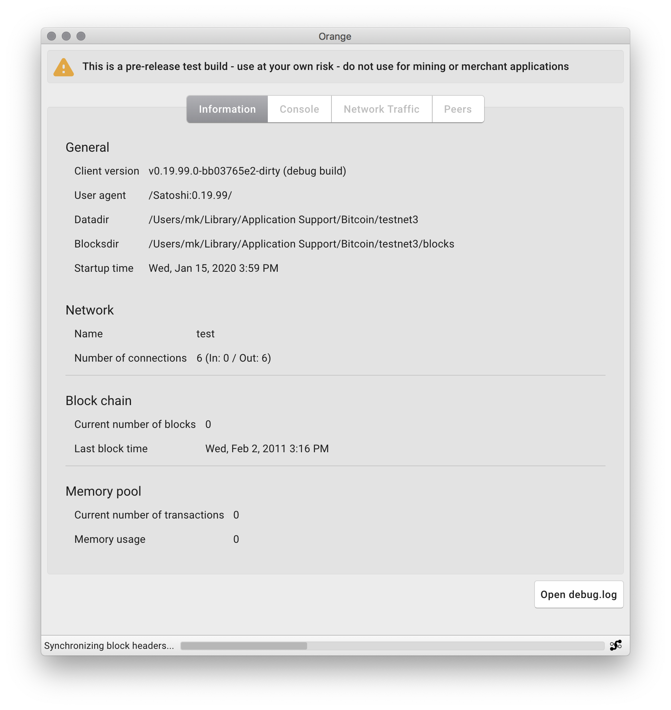

# Orange

⚠️ **WARNING**: _do not use this on a computer where you care about your Bitcoin data. This software might delete your funds, wallets, and blockchain data. This software is just a proof-of-concept. It is not meant for actual use._

Orange is a Bitcoin full node client built using Electron, TypeScript, and React. It uses Bitcoin Core's `bitcoind` under the hood.

This project is not affiliated with Bitcoin Core.

The only feature that's currently implemented is the information tab. No wallet or other operations are supported yet.

## Table of Contents

- [Goal of the project](#goal-of-the-project)
- [How it works](#how-it-works)
- [Architecture and security](#architecture-and-security)
- [Install and contribute](#install-and-contribute)
- [Questions and help](#questions-and-help)

## Goal of the project

The goal of the project is to explore using Electron, React, and TypeScript to build a better Bitcoin client on top of Bitcoin Core while still providing strong security.

## How it works

Orange is just a UI. The Bitcoin functionality comes from [`bitcoind`](https://en.bitcoin.it/wiki/Bitcoind). When you start Orange, it starts `bitcoind` and communicates with it through RPC to power the UI.

## Architecture and security

Orange uses many npm modules. Some of these npm modules could get compromised. To prevent a compromised module from causing damage, Orange is sandboxed. Orange cannot make outbound connections and cannot receive inbound connections except to and from `bitcoind`.

The communication channel between Orange and `bitcoind` is protected by a password that minimizes unauthorized use of this channel by npm modules. I say minimize and not fully prevent because some modules, such as `React`, `Redux`, or their related modules could still read this password.

I don't think this theoretical vulnerability poses a serious risk because, to exploit it, the `React`, `Redux`, or a related team would have to publish code that specifically targets Orange, and then a new version of Orange would have to import this malicious code and be released before anyone notices it. I don't think this can happen.

### Details on the architecture

All Electron applications have 3 separate processes. The nature of these 3 processes is what enables the architecture described above.

The 3 processes are called `main`, `renderer`, and `preload`. Each one of these processes is granted a different level of access privilege over the system, as described below.

#### The `main` process

In Orange the `main` has full access over the system. It uses Node.js to talk to the file system and it can talk to the operating system. **Because `main` has this much privilege, we don't use npm modules in it.**

`main` talks to `bitcoind`.

#### The `renderer` process

The `renderer` process is where the UI code actually is.

The `renderer` process has no access to Node.js APIs, the filesystem, or any operating system features. The `renderer` process is also prohibited from:

- making network requests
- loading remote content (at run time)
- opening webpages
- navigating

Some implementation details

We implement the [security recommendations](https://electronjs.org/docs/tutorial/security?q=j#checklist-security-recommendations) provided by Electron. Many of these recommendations are particular to loading "remote content", that is content over the network. In Orange we disable networking completely, but we consider npm modules in the `renderer` process to be equivalent to "remote content" so we follow these recommendations as strictly as possible:

- Node integration is disabled
- Content isolation is enabled
- Web security is enabled
- A strict content security policy is provided
- Running insecure content is disabled
- No experimental Chromium or Blink features are used
- WebView creation is disabled
- Navigation is disabled
- The remote module is disabled

#### How does `renderer` get the data to display if it's sandboxed?

This is where the `preload` process comes into play. `preload` is the middleman between `main` and `renderer`. It relays messages between the two, but only very specific kinds of messages.

#### How is the communication between `renderer` and `main` secured?

`main` and `renderer` use a nonce (i.e. password) to communicate with each other. This nonce is agreed upon between `main` and `renderer` only after all the npm modules have been downloaded, so remote code has no way of knowing what it is.

Implementation details

After the npm modules have been downloaded but before the Orange distributable is created, the string `__NONCE__` in the code will be replaced with a base64 encoded random bytes. Care has to be taken to make sure this nonce is only known to the local Orange code, not to the npm modules.

## Install and contribute

At this time, Orange will only work on macOS. The included `bitcoind` was built on macOS.

To run this locally and contribute:

1. Clone this repo
1. `cd` into the repo
1. Execute `npm install` to install the dependencies
1. Execute `npm run wds` to start the build and server for the `renderer` bundle. This command will occupy the terminal window
1. In a separate terminal window, but in the same folder, execute `npm run electron` to start the build process of the `main` bundle. This command will also occupy the terminal window

Feel free to play around with the code, make modifications, or send a PR!

**Note**: I haven't tested Orange with a fully synced blockchain. I usually test with only partially synced blockchains on testnet

## Questions and help

If you have a question or need help, [file an issue](https://github.com/orange-org/orange/issues/new) or [tweet me](https://twitter.com/msafi).
